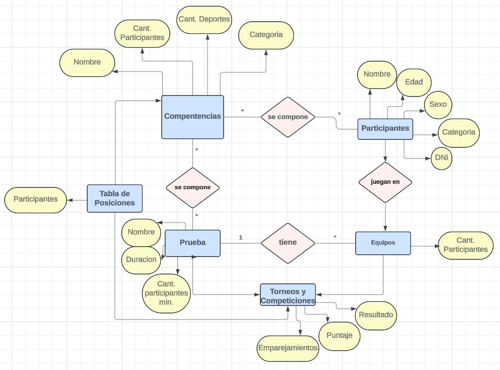

Nombre:Mateo
Apellidos:Reynoso Marin
DNI:43881462
Mail:mateoreynoso2009@gmail.com
Github:https://github.com/MateoReynosoM

Nombre:
Apellidos:
DNI:
Mail:
Github:

Nombre:
Apellidos:
DNI:
Mail:
Github:

Propuesta:
Desarrollar una aplicación que facilite la organización integral de eventos multideportivos. Esta herramienta permitirá gestionar a los participantes, agregar diversas disciplinas deportivas y organizar los encuentros, así como los horarios de cada evento de manera eficiente.

Algoritmo CompetenciaMultideportiva

    SubProceso MostrarMenu
        Escribir "Menú de Competencia Multideportiva"
        Escribir "1. Añadir Atleta" (Añadir atleta a una competencia por su id o creandolo en el momento)
        Escribir "2. Eliminar Atleta"
        Escribir "3. Añadir Deporte" (Añadir deporte a una competencia por su id o creandolo en el momento)
        Escribir "4. Eliminar Deporte"
        Escribir "5. Añadir Competencia"(Añadir competencia, sus deportes y sus participantes (opcion de seleccionar deportes aleatoriamente))
        Escribir "5. Eliminar Competencia"
        Escribir "6. Mostrar Puntajes"(Abre menu de competencias y muestra puntaje individual de cada participante por competencia)
        Escribir "8. Salir"
        Escribir "Introduce una opción: "
        Leer opcion
    FinSubProceso

    Repetir
        MostrarMenu
        Segun opcion Hacer
            Caso 1:
                AñadirAtleta (Funcionalidad por hacer)
            Caso 2:
                EliminarAtleta (Funcionalidad por hacer)
            Caso 3:
                AñadirDeporte (Funcionalidad por hacer)
            Caso 4:
                EliminarDeporte (Funcionalidad por hacer)
            Caso 5:
                RegistrarParticipacion (Funcionalidad por hacer)
            Caso 6:
                MostrarPuntajes (Funcionalidad por hacer)
            Caso 7:
                SeleccionarDeportesAleatoriamente (Funcionalidad por hacer)
            Caso 8:
                Escribir "Saliendo del programa..."
            De Otro Modo:
                Escribir "Opción inválida, por favor intenta de nuevo."
        FinSegun
    Hasta opcion = 8
FinAlgoritmo

Diagrama Entidad Relacion(chen):
